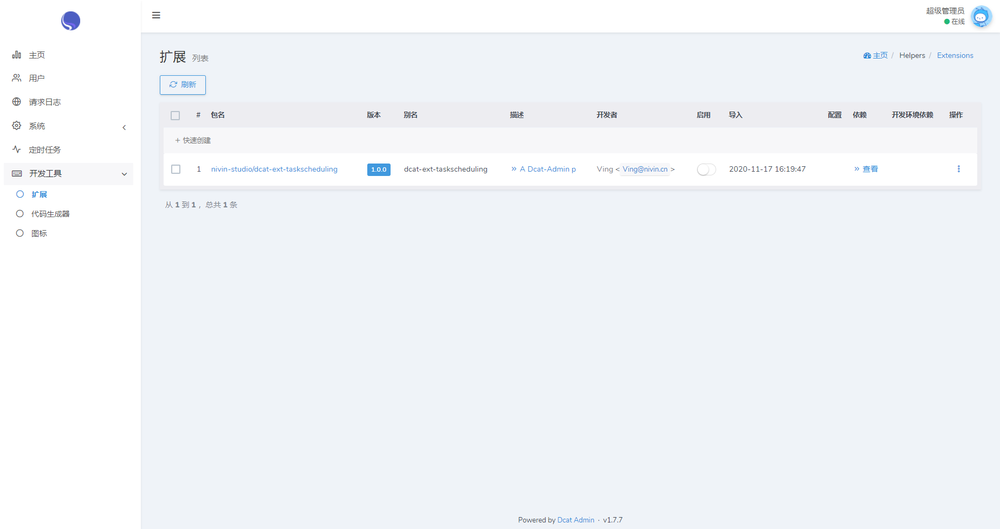
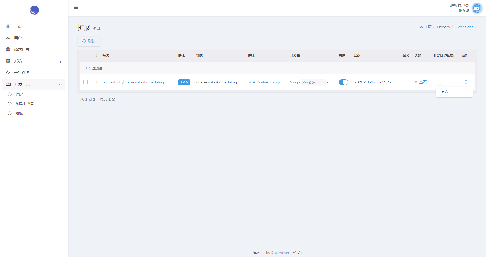
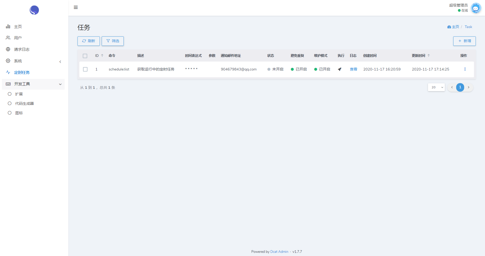

## 介绍
一个Dcat Admin的定时任务可视化管理的插件

## 环境要求
- php >= 7.3.0
- Dcat Admin 1.7.*
- Laravel 5.5.*

## 安装使用

- 安装依赖

    ```bash
    composer require nivin-studio/dcat-ext-taskscheduling
    ```

- 登录Dcat Admin后台打开“开发工具”->“扩张”菜单，在列表中找到“dcat-ext-taskscheduling”插件，选择“启用”



- 启用插件后，在“操作”中选择“导入”，导入静态资源文件、菜单、权限等。



- 运行Migrate，创建数据表

    ```bash
    php artisan migrate
    ```

- 添加Laravel计划任务至Cron中(注：php和项目都需要绝对路径，可通过命令"which php"来查看的绝对路径)

    ```bash
    * * * * * /usr/.../.../bin/php /path-to-your-project/artisan schedule:run >> /dev/null 2>&1
    ```

- 至此菜单中会多出一个“定时任务”的菜单，进去就可以添加定时任务了。


## 鸣谢
+ [Laravel](https://laravel.com/)
+ [Dact Admin](http://www.dcatadmin.com/)
+ [laravel-totem](https://github.com/codestudiohq/laravel-totem)